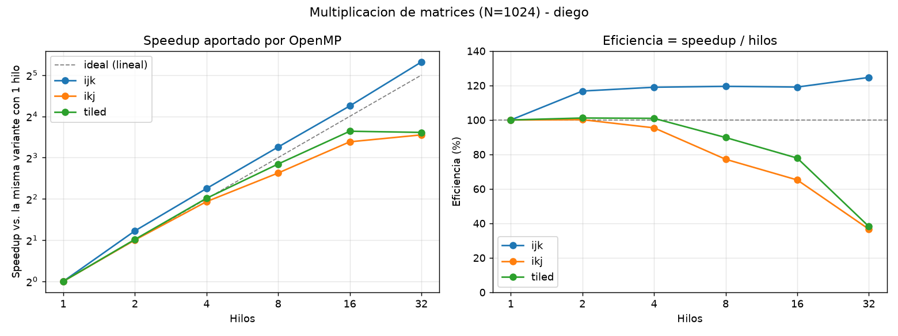
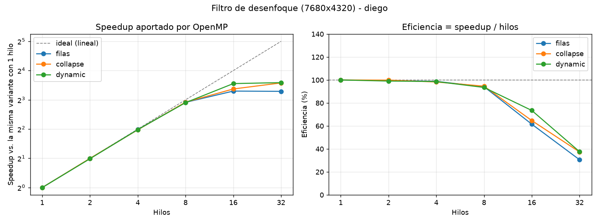
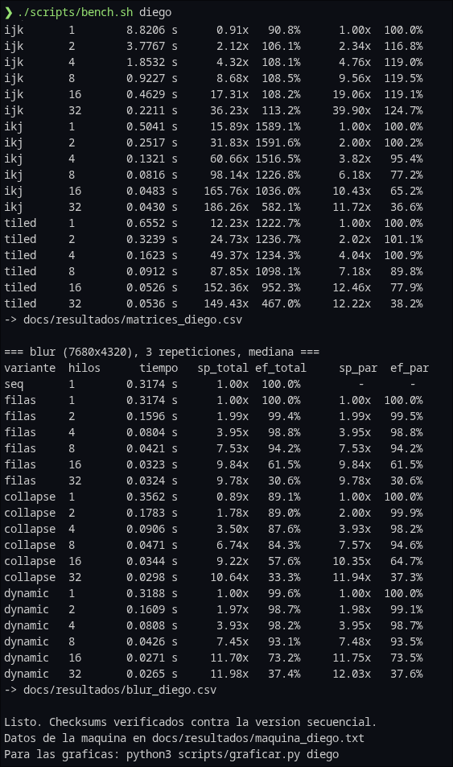
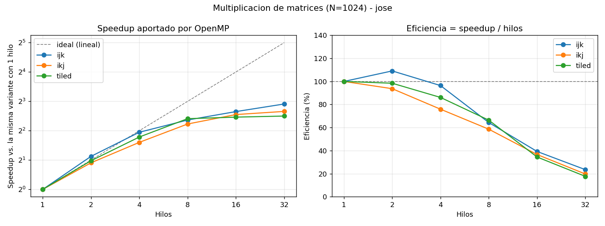
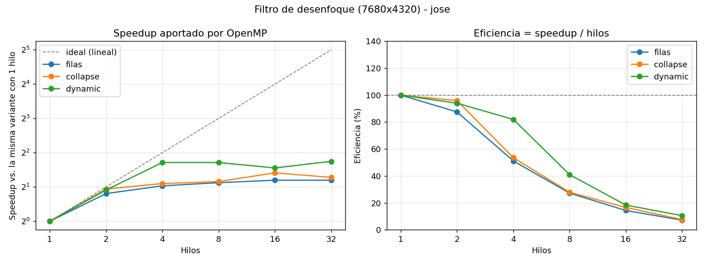
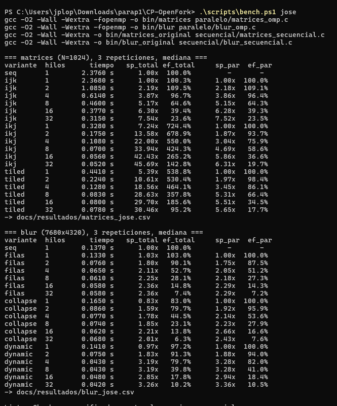
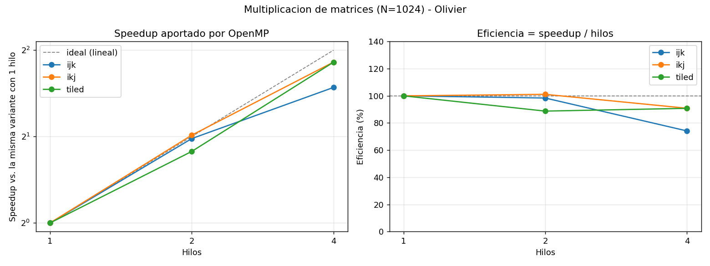
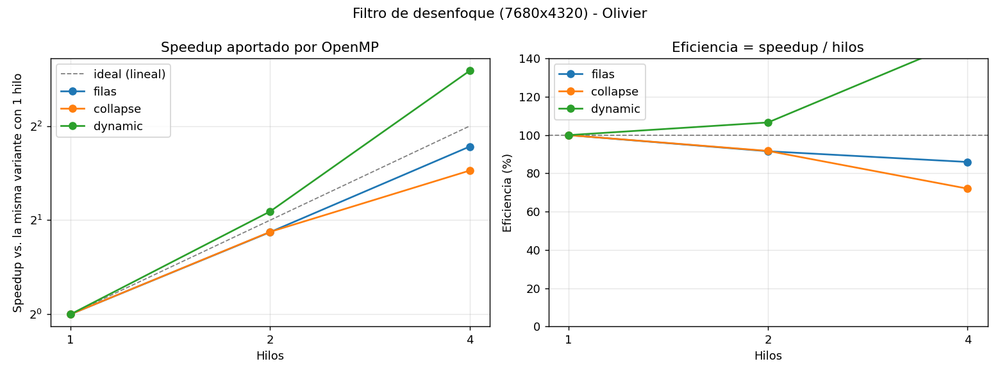
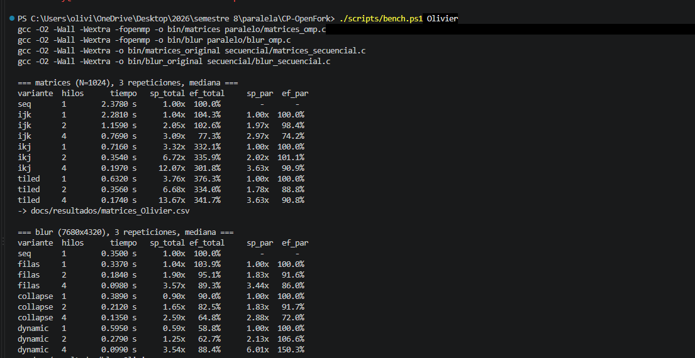

# Informe técnico

**CC3069 — Computación Paralela y Distribuida · Examen Parcial 1**
Consultora OpenFork U · Diego Rosales, Jose Lopez, Olivier Viau

---

## 1. Contexto y datos

De los tres problemas que traía el equipo elegimos dos: la **multiplicación de matrices densas**
(problema 3) y el **filtro de desenfoque sobre imagen satelital** (problema 5). El tercero quedó
fuera porque los dos elegidos plantean preguntas de optimización distintas entre sí —uno es un
problema de reuso de datos en caché y el otro de repartición de un dominio 2D con dependencias de
vecindad— y eso daba más material que dos problemas parecidos.

### 1.1 Multiplicación de matrices

La propuesta secuencial original está en [`secuencial/matrices_secuencial.c`](../secuencial/matrices_secuencial.c):
un triple ciclo `i-j-k` sobre matrices de 3×3 escritas a mano en el código. Calcula bien, pero para
medir cualquier cosa hace falta un tamaño donde el trabajo se note.

En la versión de [`paralelo/matrices_omp.c`](../paralelo/matrices_omp.c) las matrices son cuadradas
de lado `N` configurable y se llenan con `rand()` bajo una semilla fija (`20260907`). La semilla fija
es lo que permite que los tres integrantes midan sobre exactamente los mismos datos en máquinas
distintas y que los tiempos sean comparables.

Dos decisiones sobre la estructura en memoria:

- **Enteros, no punto flotante.** Los valores van de 0 a 9, así cada celda del resultado se queda muy
  por debajo del límite de `int` incluso con N=4096. La razón de fondo es la verificación: como la
  suma de enteros sí es asociativa, el checksum del resultado tiene que salir **idéntico** en las
  cuatro variantes. Si hubiéramos usado `double`, un checksum distinto podría deberse tanto a una
  condición de carrera como al simple reordenamiento de la suma, y no habría forma de distinguirlas.
- **Una sola reserva contigua** (`int *` indexado como `A[i*N+j]`) en lugar del arreglo de punteros
  del original. Con `malloc` por fila, las filas quedan dispersas en el heap y el prefetcher del
  procesador no puede anticipar nada; con un bloque contiguo, recorrer una fila es recorrer memoria
  consecutiva. Esta decisión sola ya cambia el rendimiento antes de tocar OpenMP.

El tamaño de referencia para las mediciones es **N=1024**, con una corrida adicional en N=2048 para
verificar el comportamiento a mayor escala.

### 1.2 Filtro de desenfoque

El secuencial original está en [`secuencial/blur_secuencial.c`](../secuencial/blur_secuencial.c).
Lee las dimensiones y los píxeles desde entrada estándar y, para cada píxel, promedia su valor con
el de sus vecinos en una ventana de 3×3 recortada contra los bordes de la imagen.

La versión paralela ([`paralelo/blur_omp.c`](../paralelo/blur_omp.c)) conserva el kernel tal cual y
cambia únicamente de dónde salen los datos: la imagen se genera en memoria con la misma semilla fija,
con el tamaño 8K del enunciado (**7680 × 4320 = 33.2 millones de píxeles**, 33 MB por buffer).

Se generan los píxeles en vez de leer un archivo por dos razones. La primera es que un PGM de 8K pesa
33 MB y no tiene sentido meterlo en el repositorio. La segunda es que leer 33 MB de disco toma más
tiempo que el filtro completo, así que el I/O ahogaría justamente lo que queremos medir.

Los píxeles son `unsigned char` en un bloque contiguo, y hay **dos buffers separados**: se lee de `A`
y se escribe en `B`. Esto no es un detalle de implementación, es la decisión que hace que todo el
algoritmo sea paralelizable sin sincronización, y se explica en la sección 2.2.

---

## 2. Estrategia de paralelización

### 2.1 Matrices: el problema real no era la paralelización

El enunciado pregunta cómo asignar el trabajo *minimizando la cantidad de veces que los trabajadores
leen los mismos datos*. Al analizarlo encontramos que el cuello de botella del algoritmo original no
está en el reparto, sino en el orden de los ciclos.

En el orden `i-j-k` del original, el ciclo interno recorre `A[i][k]` avanzando de a un entero
(bien) pero `B[k][j]` avanzando de a `N` enteros (mal). Cada acceso a `B` cae en una línea de caché
distinta: el procesador trae 64 bytes de RAM y usa 4. Con N=1024 eso significa recorrer los 4 MB de
`B` completos por cada fila de `C` que se calcula.

Implementamos cuatro variantes para poder separar qué ganancia vino de dónde:

| Variante | Directiva | Idea |
|---|---|---|
| `seq` | ninguna | El triple ciclo original. Línea base. |
| `ijk` | `parallel for collapse(2)` sobre `i,j` | Paralelización ingenua: repartir las celdas de `C` y ya. |
| `ikj` | `parallel for schedule(static)` sobre `i` | Reordenar los ciclos a `i-k-j` para que todos los accesos sean contiguos. |
| `tiled` | `parallel for collapse(2)` sobre los bloques | `ikj` partido en bloques de 64×64 para reusar cada bloque desde caché. |

En `ikj`, el valor `A[i][k]` se carga una vez a un registro y se reusa durante todo el ciclo interno,
mientras `B[k][*]` y `C[i][*]` se barren de corrido. El patrón de acceso pasa a ser secuencial en las
tres matrices.

**Por qué se paraleliza `i` y nunca `k`.** En `ikj` el ciclo `k` acumula sobre `C[i][j]`: dos hilos
con distinto `k` escribirían la misma celda al mismo tiempo. Es una condición de carrera de libro y
para arreglarla habría que poner `atomic` en el ciclo más interno o una `reduction` sobre toda la
matriz `C`, y cualquiera de las dos costaría más de lo que ahorra. Paralelizando `i`, en cambio, cada
hilo es dueño exclusivo de un conjunto de filas de `C` y no hay nada que sincronizar.

En `tiled` pasa lo mismo un nivel más arriba: el `collapse(2)` va sobre los índices de bloque
`(ii, jj)` y no sobre `kk`, de modo que cada hilo se queda con un bloque completo de `C` y la
acumulación en `kk` ocurre secuencialmente dentro de ese bloque.

Sobre el **scheduling**: aquí el costo de cada iteración es idéntico —toda fila de `C` cuesta lo
mismo— así que `schedule(static)` es la opción correcta. Un `dynamic` solo agregaría el costo de
repartir trabajo en tiempo de ejecución sin ningún desbalance que corregir.

### 2.2 Blur: cómo se cortan los bordes de cada recorte

El enunciado pregunta cómo repartir la imagen *asegurándose de que se puedan calcular correctamente
los píxeles que quedan exactamente en los bordes de los recortes*. La respuesta corta es que en
memoria compartida ese problema **no existe**, y vale la pena explicar por qué.

Cortamos la imagen en **franjas horizontales de filas contiguas**, una por hilo, que es literalmente
lo que hace `#pragma omp parallel for schedule(static)` sobre el ciclo de filas: con 32 hilos y 7680
filas, cada hilo recibe un bloque de 240 filas seguidas.

Un hilo que procesa la última fila de su franja necesita leer la primera fila de la franja del
vecino. Esto sería un problema serio en memoria distribuida (habría que hacer intercambio de halos
por mensajes) y también lo sería si el filtro trabajara *in situ*, porque el vecino podría haber
sobrescrito esa fila antes de que la leamos. Pero como se **lee siempre de `A` y se escribe siempre
en `B`**, `A` nunca cambia durante el cálculo: cualquier hilo puede leer cualquier fila de `A` en
cualquier momento y siempre obtiene el valor original. El único borde que sí requiere tratamiento
especial es el de la imagen misma, y eso ya lo resolvía el recorte de ventana del secuencial.

La carrera de datos hay que buscarla en otro lado. En el secuencial original, las variables
`i0, i1, j0, j1, suma` y `contador` están declaradas al inicio de `main`, fuera de los ciclos
(líneas 5–6 de `blur_secuencial.c`). Si ese código se copia tal cual dentro de una región paralela,
OpenMP las trata como **compartidas** y los hilos se pisan el acumulador y los límites de la ventana
entre sí: el resultado sale mal, distinto en cada corrida y sin que el programa falle. Es el error
más fácil de cometer en este algoritmo. En la versión paralela el cálculo de un píxel se movió a la
función `pixel_promedio()`, donde todas esas variables son locales y por lo tanto privadas por
construcción.

Se probaron tres formas de repartir para poder justificar la elección con datos y no con intuición:
`filas` (`schedule(static)`), `collapse` (`collapse(2)`, que aplana los dos ciclos en uno de 33
millones de iteraciones) y `dynamic` (`schedule(dynamic, 64)`).

---

## 3. Resultados y métricas

Las cifras salen de [`scripts/bench.sh`](../scripts/bench.sh), que corre cada configuración tres
veces y se queda con la mediana. En Windows se usó [`scripts/bench.ps1`](../scripts/bench.ps1), que
hace exactamente lo mismo: las dos versiones leen el tiempo que reporta el propio programa con
`omp_get_wtime()`, así que los resultados son comparables entre las tres máquinas.

Antes de escribir un solo tiempo, el script **compara el checksum de cada variante paralela contra el
de la secuencial y aborta si difieren**, de modo que ningún número reportado aquí viene de una
corrida que dio un resultado incorrecto.

Se reportan dos speedups porque miden cosas distintas:

- **Speedup total** = `T(secuencial original) / T(variante con p hilos)`. Es la mejora que
  efectivamente recibe el cliente.
- **Speedup paralelo** = `T(la misma variante con 1 hilo) / T(con p hilos)`. Aísla lo que aportó
  OpenMP, ya descontada la mejora que vino de reordenar los ciclos. Es el número honesto para juzgar
  la calidad del paralelismo, y es el que se usa para la eficiencia (`speedup / p`).

Los CSV completos de cada integrante están en [`resultados/`](resultados/), y las gráficas
correspondientes en [`graficas/`](graficas/), generadas con
[`scripts/graficar.py`](../scripts/graficar.py).

### 3.1 Hallazgo principal: la mitad de la ganancia no vino de paralelizar

El resultado más importante del trabajo es que en matrices, **la variante `ikj` corriendo con un solo
hilo ya es 16 veces más rápida que el secuencial original**. Sin OpenMP. Sin un solo hilo adicional.
Solo cambiando el orden de tres ciclos anidados para que la memoria se lea de corrido.

Medido en N=2048, donde el efecto es más claro (`docs/resultados/matrices_n2048_diego.txt`):

| | Tiempo | Contra el secuencial |
|---|---|---|
| `seq`, 1 hilo | 78.92 s | 1x |
| `ikj`, 1 hilo | 4.06 s | **19.5x** |
| `ikj`, 16 hilos | 0.28 s | **280x** |

De los 280x finales, 19.5x salieron de entender el hardware y 14.4x de OpenMP. Un equipo que hubiera
saltado directo a poner `#pragma omp parallel for` sobre el algoritmo original y se hubiera dado por
satisfecho con un speedup de 17x, habría dejado un orden de magnitud sobre la mesa.

### 3.2 El tiling solo paga si el conjunto de trabajo no cabe en caché

Implementamos el bloqueo por tiles esperando que fuera la mejor variante —es la respuesta de libro a
la pregunta de reuso de datos— y resultó consistentemente **más lento que `ikj` a secas**, tanto en
N=1024 (0.053 s contra 0.048 s con 16 hilos) como en N=2048 (0.351 s contra 0.282 s).

Lo reportamos así porque es el resultado real. La explicación es que a estos tamaños `ikj` ya tiene
un patrón de acceso perfectamente secuencial, que es justo lo que el prefetcher del hardware y la
autovectorización de `-O2` saben aprovechar; el tiling agrega aritmética de índices y cinco niveles
de anidamiento a cambio de un reuso de caché que en este rango de N no era el cuello de botella. El
tiling empieza a ganar cuando las matrices son mucho más grandes que la caché de último nivel, y en
esta máquina con N=2048 todavía no se llega a ese punto.

Esa última frase resultó ser comprobable dentro del mismo equipo. En la máquina de Olivier, un i5
con 9 MB de L3, las tres matrices de N=1024 ocupan 12 MB y **no** caben, y ahí el tiling sí gana:
0.174 s contra 0.197 s de `ikj`. Los números están en la sección 3.7. O sea que el tiling no es una
optimización inútil, sino una que depende de una condición concreta: que el conjunto de trabajo
exceda la última caché. En las dos máquinas donde cabía, estorbó.

Esa hipótesis quedó confirmada al medir en la tercera máquina (sección 3.7): en un i5-9600K con 9 MB
de L3, donde los 12 MB de las tres matrices ya no caben, `tiled` **sí** es la variante más rápida.
La conclusión correcta no es "el tiling no sirve", sino que su beneficio depende de la relación entre
el tamaño del problema y la caché de último nivel de la máquina donde se corra.

### 3.3 Blur: `static` alcanza hasta 8 hilos, después conviene `dynamic`

Hasta 8 hilos las tres estrategias quedan prácticamente empatadas. De ahí para arriba se separan:

- `collapse(2)` es más lento **incluso con un solo hilo** (0.356 s contra 0.317 s). Aplanar los
  ciclos obliga a recalcular `i` y `j` a partir de un índice lineal en cada una de las 33 millones de
  iteraciones. Con 7680 filas y 32 hilos ya hay trabajo de sobra para repartir, así que el
  paralelismo extra que ofrece no hace falta.
- `schedule(dynamic, 64)` empata con `static` hasta 8 hilos (0.0426 s contra 0.0421 s), pero con
  16 hilos **tarda 16% menos** (0.0271 s contra 0.0323 s), y con 32 la diferencia se mantiene
  (0.0265 s contra 0.0324 s).

Lo segundo nos sorprendió, porque el costo de cada píxel es idéntico y en teoría no hay desbalance
que corregir. La explicación es que el desbalance no viene de los datos sino del hardware: con 16
hilos o más, los hilos compiten por el ancho de banda de memoria, y con 32 además comparten núcleo
físico de a dos. Aunque todos tengan la misma cantidad de trabajo, no todos avanzan al mismo ritmo.
Con `static` cada hilo recibe una franja fija de la imagen y al final todos esperan al más lento; con
`dynamic` los hilos que van más rápido simplemente toman más bloques de 64 filas.

Es un contraste interesante con el problema del grafo, donde el desbalance sí viene de los datos
(unos nodos con 2 vecinos y otros con 10,000). Aquí los datos son perfectamente uniformes y aun así
`dynamic` termina ganando cuando se usan muchos hilos.

### 3.4 Dónde deja de convenir agregar hilos

Las dos soluciones dejan de escalar bastante antes de los 32 hilos, y por razones distintas.

El blur es un problema **limitado por ancho de banda de memoria**: mueve 66 MB entre los dos buffers
y hace apenas nueve sumas por píxel. Su eficiencia se mantiene sobre 94% hasta 8 hilos y se cae a
31% con 32. El dato más claro es que, con el reparto por filas, pasar de 16 a 32 hilos no gana
absolutamente nada (0.0323 s contra 0.0324 s): los hilos no están calculando, están esperando a la
RAM.

En matrices, `ikj` con 32 hilos es apenas 11% más rápido que con 16 (0.043 s contra 0.048 s), y
`tiled` directamente empeora (0.054 s contra 0.053 s). La máquina de prueba tiene 16 núcleos físicos
con SMT, así que los "32 hilos" son 16 núcleos con dos hilos cada uno compitiendo por la misma
unidad de ejecución y la misma caché L1; para un ciclo interno que ya satura la unidad vectorial, el
segundo hilo aporta muy poco. Duplicar los hilos para ganar 11% no es buen negocio.

Caso aparte es `ijk`, que muestra eficiencia **superior al 100%** (hasta 125% con 32 hilos). No es un
error de medición: al repartir las celdas de `C` entre hilos, cada hilo trabaja sobre un subconjunto
más pequeño de datos que le cabe mejor en su caché privada, y entre todos suman mucha más caché L1 y
L2 que un solo hilo. El paralelismo está compensando en parte el mal patrón de acceso del algoritmo
original. Es una ganancia real, pero conviene leerla como un síntoma de que el algoritmo secuencial
estaba desaprovechando la caché, no como una virtud de la paralelización.

---

### 3.5 Mediciones de Diego Rosales

**Equipo:** ver [`resultados/maquina_diego.txt`](resultados/maquina_diego.txt) — AMD Ryzen 9 8940HX,
16 núcleos físicos / 32 hilos lógicos, gcc 16.2.1, Linux.
**Datos crudos:** [`resultados/matrices_diego.csv`](resultados/matrices_diego.csv) ·
[`resultados/blur_diego.csv`](resultados/blur_diego.csv)

Matrices, N=1024 (tiempo secuencial base: 8.01 s):

| Variante | Hilos | Tiempo | Speedup total | Speedup paralelo | Eficiencia |
|---|---|---|---|---|---|
| `ijk` | 8 | 0.9227 s | 8.68x | 9.56x | 119.5% |
| `ijk` | 16 | 0.4629 s | 17.31x | 19.06x | 119.1% |
| `ijk` | 32 | 0.2211 s | 36.23x | 39.90x | 124.7% |
| `ikj` | 8 | 0.0816 s | 98.14x | 6.18x | 77.2% |
| `ikj` | 16 | 0.0483 s | 165.76x | 10.43x | 65.2% |
| `ikj` | 32 | **0.0430 s** | **186.26x** | 11.72x | 36.6% |
| `tiled` | 16 | 0.0526 s | 152.36x | 12.46x | 77.9% |
| `tiled` | 32 | 0.0536 s | 149.43x | 12.22x | 38.2% |

Blur, 7680×4320 (tiempo secuencial base: 0.3174 s):

| Variante | Hilos | Tiempo | Speedup total | Speedup paralelo | Eficiencia |
|---|---|---|---|---|---|
| `filas` | 2 | 0.1596 s | 1.99x | 1.99x | 99.5% |
| `filas` | 4 | 0.0804 s | 3.95x | 3.95x | 98.8% |
| `filas` | 8 | 0.0421 s | 7.53x | 7.53x | 94.2% |
| `filas` | 16 | 0.0323 s | 9.84x | 9.84x | 61.5% |
| `filas` | 32 | 0.0324 s | 9.78x | 9.78x | 30.6% |
| `collapse` | 32 | 0.0298 s | 10.64x | 11.94x | 37.3% |
| `dynamic` | 16 | 0.0271 s | 11.70x | 11.75x | 73.5% |
| `dynamic` | 32 | **0.0265 s** | **11.98x** | 12.03x | 37.6% |

**Lectura de estos números.** El mejor resultado en matrices es `ikj` con 32 hilos: 186x sobre el
secuencial original. Pero con 16 hilos ya se tenía 166x, así que los 16 hilos adicionales compran
apenas 11% más a cambio de duplicar los recursos, y la eficiencia paralela cae de 65% a 37%. La
eficiencia de `ikj` empieza a bajar desde los 8 hilos (77%), antes que en las otras variantes:
cuanto mejor es la línea base, antes se topa con el límite de memoria y menos margen queda para que
el paralelismo luzca.

En blur la eficiencia se mantiene sobre 94% hasta 8 hilos y luego se derrumba, lo que confirma el
límite de ancho de banda de memoria. El mejor tiempo lo da `dynamic` con 32 hilos (12x), pero en
términos prácticos ocho hilos es el punto de mejor relación entre recursos usados y tiempo ganado:
con 8 hilos se obtiene el 63% del speedup máximo usando el 25% de los hilos.

Corrida completa del benchmark. La línea del secuencial (8.01 s) quedó fuera del recorte, está en el
CSV:

---

### 3.6 Mediciones de Jose Lopez

**Equipo:** ver [`resultados/maquina_jose.txt`](resultados/maquina_jose.txt) — Intel Core
i9-13980HX, 32 hilos lógicos (arquitectura híbrida P-cores/E-cores), gcc 14.2.0 (MinGW-W64), Windows 11.
**Datos crudos:** [`resultados/matrices_jose.csv`](resultados/matrices_jose.csv) ·
[`resultados/blur_jose.csv`](resultados/blur_jose.csv)

Matrices, N=1024 (tiempo secuencial base: 2.376 s):

| Variante | Hilos | Tiempo | Speedup total | Speedup paralelo | Eficiencia |
|---|---|---|---|---|---|
| `ijk` | 8 | 0.4600 s | 5.17x | 5.15x | 64.3% |
| `ijk` | 16 | 0.3770 s | 6.30x | 6.28x | 39.3% |
| `ijk` | 32 | 0.3150 s | 7.54x | 7.52x | 23.5% |
| `ikj` | 8 | 0.0700 s | 33.94x | 4.69x | 58.6% |
| `ikj` | 16 | 0.0560 s | 42.43x | 5.86x | 36.6% |
| `ikj` | 32 | **0.0520 s** | **45.69x** | 6.31x | 19.7% |
| `tiled` | 16 | 0.0800 s | 29.70x | 5.51x | 34.5% |
| `tiled` | 32 | 0.0780 s | 30.46x | 5.65x | 17.7% |

Blur, 7680×4320 (tiempo secuencial base: 0.137 s):

| Variante | Hilos | Tiempo | Speedup total | Speedup paralelo | Eficiencia |
|---|---|---|---|---|---|
| `filas` | 2 | 0.0760 s | 1.80x | 1.75x | 87.5% |
| `filas` | 4 | 0.0650 s | 2.11x | 2.05x | 51.2% |
| `filas` | 8 | 0.0610 s | 2.25x | 2.18x | 27.3% |
| `filas` | 16 | 0.0580 s | 2.36x | 2.29x | 14.3% |
| `filas` | 32 | 0.0580 s | 2.36x | 2.29x | 7.2% |
| `collapse` | 32 | 0.0680 s | 2.01x | 2.43x | 7.6% |
| `dynamic` | 8 | 0.0430 s | 3.19x | 3.28x | 41.0% |
| `dynamic` | 16 | 0.0480 s | 2.85x | 2.94x | 18.4% |
| `dynamic` | 32 | **0.0420 s** | **3.26x** | 3.36x | 10.5% |

**Lectura de estos números.** En matrices, `ikj` con un solo hilo ya corre 7.24x más rápido que el
secuencial —un valor intermedio entre el 19.5x de la máquina de Diego y el 3.3x de la de Olivier—,
lo que confirma otra vez que el reordenamiento de ciclos es la optimización que más rinde
independientemente del hardware, aunque cuánto exactamente depende de la máquina. `tiled` resultó
consistentemente más lento que `ikj` a cada nivel de hilos (0.0780 s contra 0.0520 s con 32), igual
que en la máquina de Diego y al contrario que en la de Olivier: con N=1024 e `int`, las tres matrices
ocupan 12 MB, y la caché de este i9 (36 MB de L3 compartida) alcanza a contenerlas sin problema, así
que el bloqueo por tiles solo agrega aritmética de índices. La eficiencia paralela de `ikj` cae más
rápido que en la máquina de Diego: 58.6% con 8 hilos contra 77.2% allá, y 36.6% con 16 hilos contra
65.2% allá. La explicación más probable es la arquitectura híbrida de este procesador: los primeros
16 hilos lógicos corren en 8 P-cores con Hyper-Threading, pero de ahí en adelante el trabajo se
reparte también en E-cores más lentos, y como `schedule(static)` asigna a cada hilo el mismo número
de filas sin importar en qué tipo de núcleo corre, los hilos en E-cores se vuelven el cuello de
botella y todos los demás terminan esperándolos. El mejor tiempo es `ikj` con 32 hilos (45.69x), pero
duplicar los hilos de 16 a 32 solo mejora el tiempo un 7% (0.0560 s a 0.0520 s) mientras la eficiencia
cae de 36.6% a 19.7%, el mismo patrón de rendimientos decrecientes que reporta la sección 3.4.

En blur, `dynamic` le gana a `static` (`filas`) mucho antes que en la máquina de Diego: ya con 8
hilos `dynamic` tarda 0.0430 s contra 0.0610 s de `filas` (30% menos), mientras que en la máquina de
Diego ambas estrategias seguían empatadas hasta ese punto y la diferencia solo aparecía desde los 16
hilos. Esto es consistente con la hipótesis de la arquitectura híbrida: si algunos hilos corren en
E-cores más lentos, el desbalance entre hilos aparece con menos hilos activos que en un procesador
homogéneo, y ahí es exactamente donde `dynamic` tiene margen para reasignar bloques de 64 filas a los
hilos que van más rápido. `filas` deja de ganar nada entre 16 y 32 hilos (0.0580 s en ambos casos),
la misma saturación de ancho de banda que se documenta en 3.4, mientras que `dynamic` sigue bajando
levemente hasta los 0.0420 s con 32 hilos, su mejor tiempo. Con 8 hilos, sin embargo, `dynamic` ya
tiene 41.0% de eficiencia paralela contra apenas 10.5% con 32 hilos por una mejora de tiempo de menos
de 1 ms: la mejor relación entre recursos y ganancia en esta máquina está en 8 hilos, no en el
máximo disponible.

Corrida completa del benchmark:

---

### 3.7 Mediciones de Olivier Viau

**Equipo:** ver [`resultados/maquina_Olivier.txt`](resultados/maquina_Olivier.txt) — Intel Core
i5-9600K @ 3.70 GHz, 6 núcleos físicos / 6 hilos lógicos (sin SMT), 9 MB de caché L3, gcc 16.1.0
(MSYS2), Windows 10 Pro.
**Datos crudos:** [`resultados/matrices_Olivier.csv`](resultados/matrices_Olivier.csv) ·
[`resultados/blur_Olivier.csv`](resultados/blur_Olivier.csv)

Al tener solo 6 hilos lógicos, el barrido llega hasta 4 hilos: correr con 6 u 8 dejaría al proceso
compitiendo con el sistema operativo por los mismos núcleos y los tiempos dejarían de ser
comparables.

Matrices, N=1024 (tiempo secuencial base: 2.378 s):

| Variante | Hilos | Tiempo | Speedup total | Speedup paralelo | Eficiencia |
|---|---|---|---|---|---|
| `ijk` | 1 | 2.281 s | 1.04x | 1.00x | 100.0% |
| `ijk` | 2 | 1.159 s | 2.05x | 1.97x | 98.4% |
| `ijk` | 4 | 0.769 s | 3.09x | 2.97x | 74.2% |
| `ikj` | 1 | 0.716 s | 3.32x | 1.00x | 100.0% |
| `ikj` | 2 | 0.354 s | 6.72x | 2.02x | 101.1% |
| `ikj` | 4 | 0.197 s | 12.07x | 3.63x | 90.9% |
| `tiled` | 1 | 0.632 s | 3.76x | 1.00x | 100.0% |
| `tiled` | 2 | 0.356 s | 6.68x | 1.78x | 88.8% |
| `tiled` | 4 | **0.174 s** | **13.67x** | 3.63x | 90.8% |

Blur, 7680×4320 (tiempo secuencial base: 0.350 s):

| Variante | Hilos | Tiempo | Speedup total | Speedup paralelo | Eficiencia |
|---|---|---|---|---|---|
| `filas` | 1 | 0.337 s | 1.04x | 1.00x | 100.0% |
| `filas` | 2 | 0.184 s | 1.90x | 1.83x | 91.6% |
| `filas` | 4 | **0.098 s** | **3.57x** | 3.44x | 86.0% |
| `collapse` | 1 | 0.389 s | 0.90x | 1.00x | 100.0% |
| `collapse` | 2 | 0.212 s | 1.65x | 1.83x | 91.7% |
| `collapse` | 4 | 0.135 s | 2.59x | 2.88x | 72.0% |
| `dynamic` | 1 | 0.595 s | 0.59x | 1.00x | 100.0% |
| `dynamic` | 2 | 0.279 s | 1.25x | 2.13x | 106.6% |
| `dynamic` | 4 | 0.099 s | 3.54x | 6.01x | 150.3% |

**Lectura de estos números.** Esta máquina es la contraparte útil de la de Diego: seis núcleos sin
SMT y 9 MB de L3 contra dieciséis núcleos con SMT y una L3 mucho más grande. Tres cosas cambian.

**El reordenamiento de ciclos rinde bastante menos.** `ikj` con un hilo es 3.3x más rápido que el
secuencial, no 19.5x. La diferencia no está en el algoritmo sino en el punto de partida: el
secuencial original ya corre en 2.38 s aquí contra 8.01 s en la máquina de Diego, porque este i5
tiene mayor frecuencia por núcleo y menos penalización en los accesos salteados a `B`. El
reordenamiento sigue siendo la optimización más rentable por unidad de esfuerzo —un cambio de tres
líneas que vale más que pasar de 1 a 4 hilos— pero cuánto exactamente rinde depende de la máquina.

**Aquí el tiling sí paga, y es el resultado opuesto al de la sección 3.2.** `tiled` con 4 hilos da el
mejor tiempo en matrices (0.174 s contra 0.197 s de `ikj`, 12% mejor), y también gana con 1 hilo
(0.632 s contra 0.716 s). La explicación cierra con la que se dio en 3.2: con N=1024 e `int`, las
tres matrices ocupan 12 MB y no caben en los 9 MB de L3 de este procesador, así que el bloqueo por
tiles evita releer `B` desde RAM y se paga solo. En la máquina de Diego, con una L3 mucho más grande,
las mismas matrices caben enteras y el tiling solo agrega aritmética de índices. Es decir, el tiling
no es "una optimización que no paga": paga exactamente cuando el conjunto de trabajo excede la última
caché, que es lo que predice la teoría.

**En blur, `dynamic` no conviene.** Con 4 hilos empata con `filas` (0.099 s contra 0.098 s), y su
corrida de un hilo es notablemente más lenta (0.595 s contra 0.337 s). El 150% de eficiencia paralela
de `dynamic` con 4 hilos es un artefacto de esa línea base mala, no una ganancia real: comparado
contra el secuencial verdadero el speedup es 3.54x, prácticamente el mismo que el de `filas`. La
ventaja que `dynamic` mostraba en la máquina de Diego aparecía recién con 16 hilos, cuando los hilos
dejan de avanzar al mismo ritmo por competir entre sí; con 4 núcleos exclusivos ese desbalance no
existe y solo queda el costo de repartir bloques en tiempo de ejecución. `collapse` pierde por el
mismo motivo que allá: es más lento incluso con un hilo (0.389 s contra 0.337 s).

En blur, la eficiencia con `filas` se mantiene en 86% con 4 hilos, mejor que el 61% que se veía con
16 hilos en la otra máquina. Con pocos núcleos el ancho de banda de memoria todavía alcanza; el techo
de 3.57x sobre 4 hilos es un escalamiento sano y el límite aquí es simplemente la cantidad de núcleos
disponibles, no la RAM.

Corrida completa del benchmark:

---

## 4. Conclusiones

En matrices la ganancia grande vino de reordenar los ciclos, no de OpenMP: `ikj` con un solo hilo ya
supera al secuencial por 19x, y el paralelismo agrega 14x encima. La optimización que parecía más
sofisticada —el tiling— resultó ser más lenta que la simple en la máquina con L3 grande y más rápida
en la de L3 chica: no hay una respuesta única, depende de si el conjunto de trabajo cabe o no en la
última caché.

En blur la decisión importante no fue la directiva sino mantener los buffers de lectura y escritura
separados, que es lo que elimina el problema de los bordes de cada recorte, y no arrastrar las
variables temporales del secuencial hacia la región paralela. Con eso resuelto, `schedule(static)`
por franjas de filas es la respuesta correcta hasta 8 hilos; con más hilos conviene `dynamic`,
porque los hilos dejan de avanzar al mismo ritmo aunque el trabajo sea el mismo.

Las dos soluciones dejan de escalar entre los 8 y los 16 hilos por saturación de memoria, mucho antes
de los 32 hilos disponibles. Saber dónde está ese punto es parte del trabajo: pedir 32 hilos para el
blur cuesta el cuádruple de recursos que pedir 8 y, con el mismo reparto por filas, devuelve apenas
30% más de velocidad.
